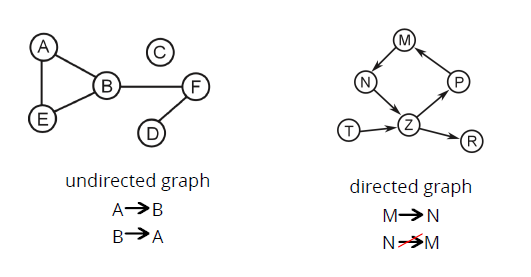

# Solve Graph
## Introducción
Un grafo/graph es un set de vertices conectados entre ellos por aristas.

### Undirected vs. Directed Graphs
<p>

</p>

### ¿Qué hay que hacer?
Escribe una función que determine si existe un path entre dos vertices de un graph.   

El graph será representado como un objeto. Cada key representa un vértice. El valor, todos los vertices que pueden ser alcanzados.

El graph, será un *'directed graph'*.

<p></p>

Como observamos, en la imagen de la izquierda el nodo 'a' se conecta con el nodo 'b', el nodo 'b' con el nodo 'c' y 'd' y por último, el nodo 'c' con el nodo 'd'.

## Solución
### En palabras
- La solución puede ser un algoritmo **Breadth-First** o **Depth-First**
- Pero... los graphs pueden ser cíclicos
  -  Si empezamos recorriendo el vértice A, eventualmente vamos a llegar al vértice R que apunta devuelta al A.

```javascript
{
    a: ['c'],
    c: ['s', 'r'],
    r: ['a'],
    s: [ ]
}
```
- ¿El problema? Un algoritmo normal de BFS/DFS terminaría en un **loop infinito**.
- Por lo tanto, tu algoritmo tiene que traquear todos los vertices que visitó
- Si un vértice ha sido visitado sabemos que no tenemos que recorrer sus aristas por segunda vez
- El **algoritmo se completa** cuando se ha encontrado el target o cuando todas las posibilidades fueron recorridas.